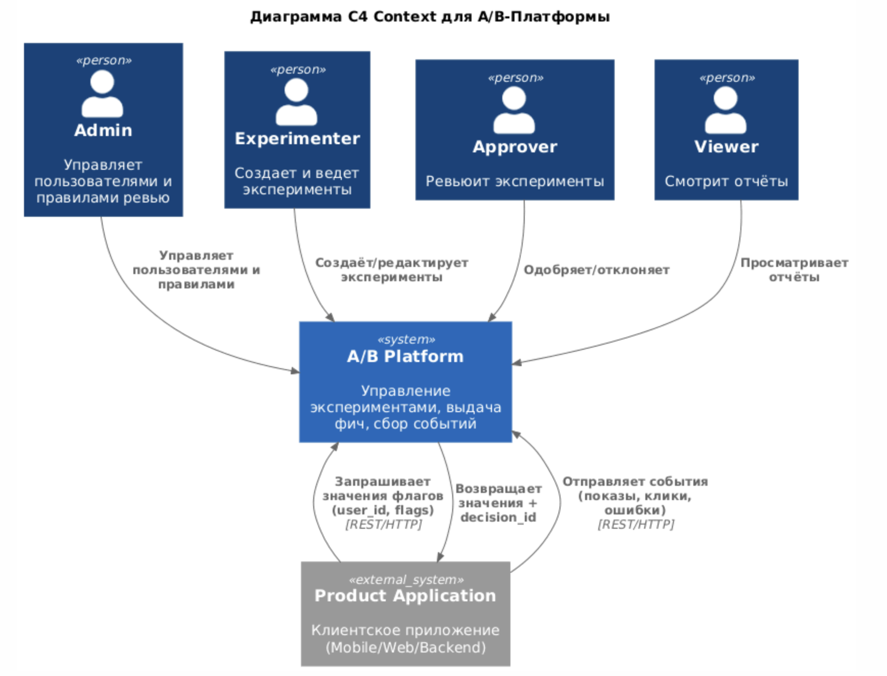
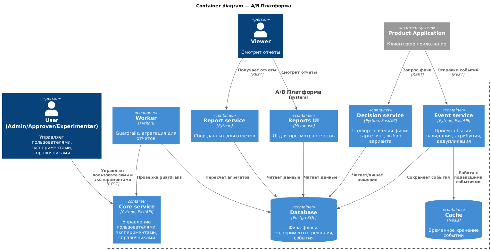
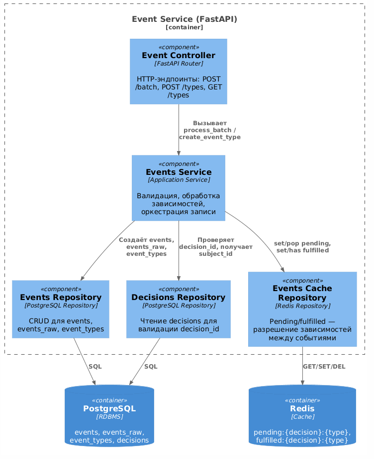

## Архитектура системы и диаграммы

--- 
## Диаграмма С4 L1

--- 
## Диаграмма С4 L2

--- 
## Диаграмма С4 L2

### Как работает экспозиция
Экспозиция - это зависимость одного типа событий от другого типа событий, может настраиваться гибко. При создании типа события можно задать поле requires_event_type с типом события-экспозиции для создаваемого типа события.  

### Оптимизация критичного пути batch events
Для оптимизации горячего пути (массовая вставка событий) используется кеширование в Redis. Без этого создавалась бы слишком большая нагрузка чтения/записи на таблицу Events в Postgres, так как для каждого события проверяется, не является ли оно экспозицией другого события, которое пришло раньше. Поиск по всей таблице для каждого события замедлил бы работу системы на больших данных

Сейчас кеширование реализовано так:
    1. Если событие не требует экспозиции:
        Событие записывается в таблицы Events и EventsRaw в Postgres со статусом received, а также кешируется в Redis. Происходит проверка, есть ли в Redis события, которые ожидают пришедшее событие. Если они есть, их статусы обновляются в EventsRaw на received и они записываются в Events в Postgres
    2. Если событие требует экспозиции:
        СПроисходит проверка, есть ли в Redis событие-экспозиция. Если оно есть, оно удаляется из Redis и пришедшее событие записывается в таблицу Events и EventsRaw в Postgres со статусом received. Иначе оно отправляется в Redis на ожидание экспозиции и в EventsRaw со статусом Pending

Таблица Events нужна для продуктовых метрик, таблица EventsRaw - для технических (сколько событий, каких, сколько отклонено итд)

Риски и проблемы данного решения: 
* При очистке Redis события навсегда останутся в pending если не дождались экспозиции.
* Максимальная глубина зависимости 1 (экспозиция не может требовать экспозицию)
* Поиск по всей таблице EventsRaw при обновлении статуса pending события

Однако это решение было выбрано потому что оно сильно разгружает таблицу Events и не создает нагрузку в виде большого количества чтения/записи по всей таблице (в основном события просто добавляются), а поиск в Redis занимает гораздо меньше времени, чем в Postgres.

### Ограничение нагрузки в момент подсчета метрик (оптимизация пути reports) - materialized view
Для того чтобы ограничить нагрузку на таблицу Events раз в несколько секунд/минут (задается в конфиге) строится MV (материализованное view в Postgres) с данными таблицы events и данными других таблиц, которые нужны для построения метрик. Туда добавляются варианты, типы экспериментов и так далее. Это сырые данные без агрегации. Агрегация каждый раз происходит в рантайме, чтобы пересчитывать метрики под любое окно заданное в отчете. Однако агрегация в reports не затрагивает таблицу Events и не создает нагрузку на нее, так как чтение происходит из MV.

Риски и проблемы данного решения: 
* MV перестраивается не постоянно, отчет может содержать устаревшие данные (в рамках демо пересчитывается раз в несколько секунд, но в реальной системе это будут часы)
* MV считается даже если отчет не нужен, то есть избыточные запросы к бд

Однако я решил, что лучше избыточные запросы, но контролируемо, чем неконтролируемая нагрузка, поэтому был выбран этот вариант.

### Раздача эксперимента и весов - как работает stickiness
Эксперимент раскатывается на тот процент аудитории, который выбран при создании эксперимента. Метрики собираются только по тем пользователям, которые участвуют в эксперименте. Если пользователь не попадает в аудиторию эксперимента из-за распределения, он получает default значение флага и id decision = null. Это значит что решение о выдаче флага никуда не было сохранено, и он не должен отправлять события, ведь события должны быть привязаны к варианту и эксперименту. Однако, несмотря на то что решение не сохраняется, пользователь все равно каждый раз будет получать default значение, если он не попал в аудиторию в первый раз. Это реализовано с помощью hash-based распределения вариантов. Строится хеш на основе id эксперимента и id пользователя внешней системы (subject id) и далее переводится в число и нормируется к 100. После этого он попадает в один из бакетов, на основе этого выбирается вариант эксперимента или дефолтный вариант и не выдача эксперимента.

### Метрики эксперимента
На этапе создания эксперимента к эксперименту можно прикрепить метрики из каталога метрик. Это могут быть метрики типа primary (основная метрика), secondary и guardrails. Метрики guardrails будут скрыты из отчета по эксперименту, остальные будут посчитаны целиком и для каждого варианта отдельно. 

### Срабатывание guardrails
Раз в некоторое время во всех экспериментах пересчитываются метрики для всех вариантов, кроме контрольного. Если значение на одном из вариантов превышает допустимое, эксперимент ставится на паузу или переходит в finished со статусом rollback (подробнее ниже). Метрики для guardrails пересчитваются по MW для метрик. Guardrails -- это обычные метрики из каталога метрик, на этапе создания эксперимента они помечаются для него как guardrails. 

Риски и проблемы данного решения:
* 

### Rollback
Трактовка rollback в системе единообразна - эксперимент переходит в finished с фиксированием бизнес-решения rollback и описанием. После этого пользователь видит дефолтное значение. Эксперимент не продолжается

При срабатывании guardrails если в guardrails было выбрано действие rollback - эксперимент автоматически переходит в finished с описанием, где говорится что сработал guardrails.

Риски и проблемы данного решения: 
* Контрольный вариант может не совпадать с дефолтным значением (control вариант и его значения задаются вручную при создании эксперимента)

Однако если контрольный вариант не совадает с дефолтным значением флага, я считаю, что откатываться надо к default значению, а не к тому, что указано в control варианте. Откат - это возврат системы в предсказуемое состояние с предсказуемым поведением. Если "откатить" систему к непонятному control варианту, который до эксперимента не был дефолтным значением, поведение будет непредсказуемо. Сейчас можно задать в control варианте значение, отличное от default того флага, на котором проводится эксперимент, но система будет делать rollback к дефолтному значению, чтобы не аффектить на собираемые метрики и пользователей, не участвующих в эксперименте.

## Ключевые ограничения и упрощения

### Сброс состояние pending событий при перезапуске
При перезапуске Redis теряется информация о pending событиях, они навсегда останутся в pending

### Metabase подключен к Postgres
Metabase для визуализации из доп критериев подключен напрямую к базе данных Postgres. в рамках MVP - это приемлемое решение. В дальнейшем можно экспортировать метрики в clickhouse/prometheus и подключать metabase туда.

### Контрольный вариант может не совпадать с default значением флага
Система позволяет задавать контрольным вариантом не тот, что сейчас в default. Это сделано для гибкости, чтобы можно было сравнивать конверсии любых вариантов, даже не с дефолтным значением. Однако при откате откат будет к default значению флага, это более предсказуемо и понятно.

### Materialized View и подсчет метрик (агрегация) в Postgres
Несмотря на MV и ограничение на нагрузку записи в таблицу Events, агрегация в Postgres может быть сложной операцией при очень большом объеме данных. При росте нагрузки можно добавить партиционирование по времени для таблицы Events. Если этого не будет хватать, можно выгружать метрики в clickhouse или другую отдельную систему и производить агрегацию там. В рамках данного проекта с текущими объемами данных и выделенными мощностями я считаю что это оверкилл, поэтому я выбрал считать метрики в postgres, но с оптимизацией.

